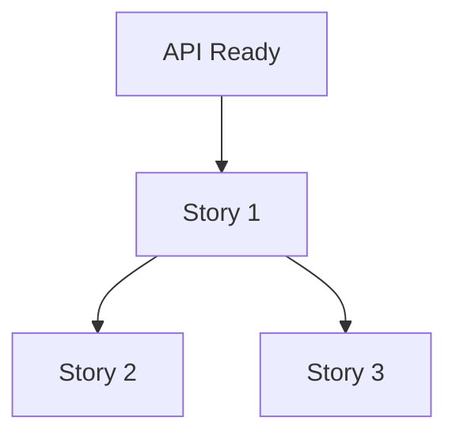

# Backlog Groomer

Refine and organize product backlog with prioritization, sizing, and readiness assessment.

## Usage

```
/pm:backlog-groom [optional: epic or theme]
```

## What This Command Does

Facilitates backlog refinement by:
1. Reviewing and updating stories
2. Assessing story readiness
3. Sizing and estimating
4. Prioritizing items
5. Identifying dependencies
6. Organizing into themes/epics

## Instructions

1. **Review Each Story**:
   - Is it still relevant?
   - Is it well-defined?
   - Does it meet Definition of Ready?

2. **Check Readiness**:
   - Clear acceptance criteria
   - Understood by team
   - Sized appropriately (<13 points)
   - No blockers
   - Dependencies identified

3. **Prioritize**:
   - Apply RICE or ICE scoring
   - Stack rank within epic
   - Consider dependencies

4. **Organize**:
   - Group into epics/themes
   - Sequence logically
   - Identify quick wins

## Template

```markdown
# Backlog Refinement: [Date]

## Summary
**Stories Reviewed**: [N]
**Ready for Sprint**: [N]
**Needs Work**: [N]
**Closed/Removed**: [N]

---

## Epic: [Epic Name]

### Story 1: [Title]
**Status**:  Ready | ⚠️ Needs Work |  Blocked

**Readiness Checklist**:
- [x] User story format
- [x] Acceptance criteria (Given-When-Then)
- [x] Sized (< 13 points)
- [ ] Mockups available
- [x] Dependencies clear
- [x] Team understands

**Size**: [5 points]
**Priority**: P0
**RICE Score**: [2400]

**Next Steps**: Need design mockups

---

### Story 2: [Title]
[Same structure]

---

## Prioritized Backlog

| Priority | Story | Size | RICE | Status | Sprint |
|----------|-------|------|------|--------|--------|
| P0 | Story 1 | 5 | 2400 | Ready | Next |
| P0 | Story 2 | 8 | 2100 | Ready | Next |
| P1 | Story 3 | 3 | 1800 | Needs work | Future |
| P1 | Story 4 | 5 | 1200 | Blocked | Future |

---

## Stories Ready for Next Sprint
1. [Story 1] - 5 points
2. [Story 2] - 8 points
**Total**: 13 points

---

## Stories Needing Work

### [Story Title]
**Issues**:
- Missing acceptance criteria
- Unclear scope

**Owner**: [Name]
**Deadline**: [Date]

---

## Dependencies



---

## Removed/Closed
- [Story X]: No longer relevant (market changed)
- [Story Y]: Duplicate of Story Z

---

## Action Items
- [ ] [Name] to add mockups for Story 1 by [date]
- [ ] [Name] to break down Story 5 (too large)
- [ ] [Name] to clarify requirements for Story 3
```

## Model
claude-sonnet-4-5

## Related
- `/pm:sprint-plan` - Plan next sprint
- `/pm:prioritize` - Score features
- `/pm:user-stories` - Create stories
