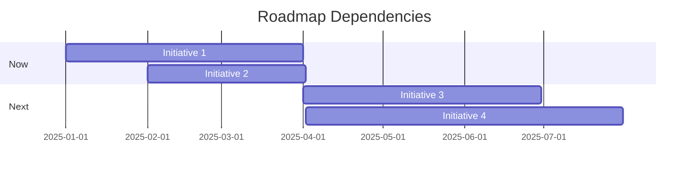

# Roadmap Builder

Create strategic product roadmaps using Now-Next-Later or quarterly themes.

## Usage

```
/pm:roadmap [product or initiative name] [optional: timeframe]
```

## What This Command Does

1. Creates a visual, strategic product roadmap
2. Organizes initiatives by timeframe (Now/Next/Later or Quarterly)
3. Connects roadmap items to strategic goals
4. Provides outcome-focused themes
5. Includes success metrics and dependencies

## Instructions

When creating a roadmap:

1. **Understand Context** (ask if needed):
   - Product vision and strategy
   - Time horizon (6 months, 1 year, 3 years)
   - Current product state
   - Strategic goals/OKRs
   - Resource constraints
   - Key assumptions and dependencies

2. **Choose Format**:
   - **Now-Next-Later**: For flexible, theme-based roadmaps
   - **Quarterly**: For more structured timelines
   - **Release-based**: For major version planning

3. **Structure Roadmap**:
   - **Vision** (3-year north star)
   - **Strategic Themes** (3-5 focus areas)
   - **Initiatives** grouped by timeframe
   - **Success Metrics** for each
   - **Dependencies** and risks

4. **For Each Initiative**:
   - Clear outcome (not just features)
   - User and business value
   - Success criteria
   - Dependencies
   - Status/confidence level

5. **Make It Visual**:
   - Use markdown tables or mermaid diagrams
   - Color-code by theme
   - Show dependencies
   - Indicate confidence levels

## Template

```markdown
# [Product] Roadmap

**Last Updated**: [Date]
**Timeframe**: [Period]
**Owner**: [PM Name]

---

## Vision (3-Year)
[Aspirational future state - where are we going?]

---

## Strategic Themes

### Theme 1: [Name]
**Goal**: [What we're trying to achieve]
**Why**: [Strategic importance]
**Metrics**: [How we measure success]

### Theme 2: [Name]
[Same structure]

---

## Now (Current Quarter)
*What we're actively building*

| Initiative | Theme | Outcome | Metrics | Status | Confidence |
|------------|-------|---------|---------|--------|------------|
| [Initiative 1] | Theme 1 | [Expected outcome] | [Success metric] | In Progress | High |
| [Initiative 2] | Theme 2 | [Expected outcome] | [Success metric] | Planning | Medium |

**Dependencies**: [Critical blockers or cross-team dependencies]

---

## Next (Next 2-3 Quarters)
*What's on deck*

| Initiative | Theme | Outcome | Metrics | Dependencies |
|------------|-------|---------|---------|--------------|
| [Initiative 3] | Theme 1 | [Expected outcome] | [Success metric] | [Tech X complete] |
| [Initiative 4] | Theme 3 | [Expected outcome] | [Success metric] | [Partner Y] |

---

## Later (6-12 Months)
*Exploration and future bets*

| Initiative | Theme | Potential Impact | Validation Needed |
|------------|-------|------------------|-------------------|
| [Exploration 1] | Theme 2 | [Opportunity] | [Research/spike needed] |
| [Exploration 2] | Theme 3 | [Opportunity] | [Tech feasibility] |

---

## Out of Scope
*Explicitly not doing (and why)*
- [Item 1]: [Rationale for deprioritization]
- [Item 2]: [Rationale for deprioritization]

---

## Assumptions & Risks

**Assumptions**:
- [Key assumption 1]
- [Key assumption 2]

**Risks**:
- [Risk 1] → [Mitigation plan]
- [Risk 2] → [Mitigation plan]

---

## Dependencies


```

## Example

**Input**: "Create a roadmap for our AI product assistant"

**Output**:

```markdown
# AI Product Assistant - 2025 Roadmap

## Vision
Empower every PM to work 10× faster with an AI copilot that handles busywork,
so PMs focus on strategy and user impact.

## Strategic Themes

### Theme 1: Core Intelligence
Build foundational AI capabilities that understand product context

### Theme 2: Workflow Automation
Automate repetitive PM tasks (PRDs, updates, prioritization)

### Theme 3: Team Collaboration
Make AI insights available to the whole team

---

## Now (Q1 2025)

| Initiative | Theme | Outcome | Metrics | Status |
|------------|-------|---------|---------|--------|
| PRD Generator | Theme 2 | PMs write PRDs in 10 min vs 2 hrs | 70% PRD adoption | In Progress |
| Smart Prioritization | Theme 1 | AI suggests feature priority | 60% accept suggestions | Planning |

---

## Next (Q2-Q3 2025)

| Initiative | Theme | Outcome | Metrics |
|------------|-------|---------|---------|
| Meeting Summarizer | Theme 2 | Auto-generate stakeholder updates | 80% update automation |
| Team Analytics | Theme 3 | Insights dashboard for leadership | Weekly active usage |

---

## Later (Q4 2025)

| Initiative | Theme | Impact | Validation |
|------------|-------|--------|------------|
| Predictive Roadmapping | Theme 1 | AI predicts project timelines | Accuracy testing needed |
| Integration Ecosystem | Theme 3 | Connect all PM tools | Partner discussions |
```

## Model

Use: claude-sonnet-4-5 (strategy requires advanced reasoning)

## Related

- `/pm:okr` - Create OKRs aligned to roadmap
- `/pm:quarterly-planning` - Detailed quarterly plan
- `/pm:prioritize` - Score and rank initiatives
