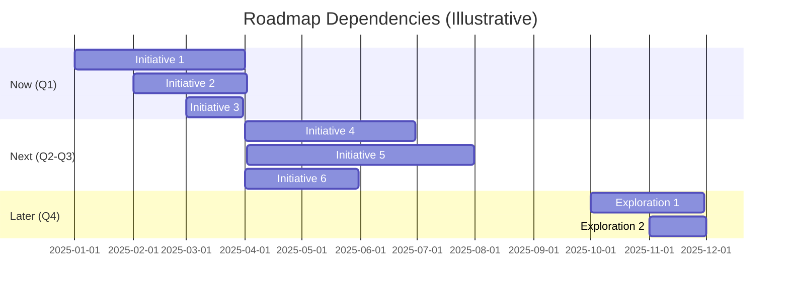

# Roadmap Builder

Create strategic product roadmaps that align teams, communicate vision, and guide execution without over-committing to dates.

## Usage

```
/pm:roadmap [product or initiative name] [optional: timeframe]
```

## What This Command Does

1. **Creates outcome-focused roadmaps** (saves 2-4 hours of planning and formatting)
2. **Organizes initiatives** by timeframe (Now/Next/Later or Quarterly) with clear themes
3. **Connects roadmap to strategy** by linking initiatives to company goals and OKRs
4. **Provides stakeholder communication** formats for exec reviews and team alignment
5. **Balances flexibility and clarity** to avoid date-driven commitments while showing progress
6. **Highlights dependencies** and risks to enable better planning and coordination

## Instructions

**Context from command**: $ARGUMENTS

### 1. Gather Required Information

**IMPORTANT**: If $ARGUMENTS is empty or insufficient, gather this information from the user:

**Product Context**:
- What product or area is this roadmap for? (entire product, specific feature area, platform)
- What's the current product state? (early stage, growth, mature, declining)
- Who owns this roadmap? (PM name, team)
- When was the last roadmap update? (if this is a refresh)

**Strategic Context**:
- What's the product vision? (3-year north star)
- What are the company OKRs for this period? (link roadmap to goals)
- What strategic themes are priorities? (growth, retention, infrastructure, new markets)
- What's the competitive landscape? (threats, opportunities)

**Audience & Purpose**:
- Who is this roadmap for? (exec team, engineering, customers, board)
- What's the purpose? (alignment, funding request, customer communication)
- What format do they prefer? (Now-Next-Later, quarterly, theme-based, timeline)
- How often will you update this? (monthly, quarterly)

**Scope & Constraints**:
- What timeframe? (6 months, 1 year, 3 years)
- What resources are available? (team size, budget, partnerships)
- What initiatives are already committed? (contractual obligations, board commitments)
- What initiatives are explicitly out of scope? (to manage expectations)

**Inputs to Roadmap**:
- What user research exists? (pain points, requests, jobs-to-be-done)
- What's the backlog of ideas? (features, improvements, technical debt)
- What dependencies exist? (platform work, partner integrations, other teams)
- What assumptions underpin the roadmap? (market, technology, resources)

### 2. Choose the Right Roadmap Format

**Now-Next-Later** (Recommended for most PMs):
- **Best for**: Flexibility, avoiding date commitments, outcome-focused communication
- **Timeframes**: Now = current quarter, Next = 2-3 quarters, Later = 6-12 months
- **Pros**: Low pressure on dates, easy to adjust, focuses on outcomes
- **Cons**: Less precise for planning, requires frequent updates
- **Use when**: Uncertainty is high, you want to avoid committing to dates

**Quarterly Roadmap**:
- **Best for**: Structured planning, exec alignment, OKR-driven organizations
- **Timeframes**: Q1, Q2, Q3, Q4 (with month-level detail)
- **Pros**: Clear timelines, easy to track progress, aligns with business planning
- **Cons**: Feels like commitment, hard to adjust mid-quarter
- **Use when**: Company operates on quarterly planning cycles, execs want dates

**Theme-Based Roadmap**:
- **Best for**: Strategic communication, communicating "why" not just "what"
- **Timeframes**: Ongoing themes, not time-bound
- **Pros**: Communicates strategy clearly, focuses on outcomes, easy to understand
- **Cons**: Lacks timeline clarity, harder to track progress
- **Use when**: Presenting to execs, board, or customers (high-level strategic view)

**Release-Based Roadmap**:
- **Best for**: Versioned products (v2.0, v3.0), major launches, customer communication
- **Timeframes**: Major releases (v2.5, v3.0, v4.0)
- **Pros**: Clear milestones, aligns with marketing launches
- **Cons**: Ties you to dates, feels like promises to customers
- **Use when**: Shipping major versions, customer-facing roadmap, marketing launches

### 3. Structure Your Roadmap

**Essential Elements** (all formats):
1. **Vision** (3-year north star): Where are we going?
2. **Strategic Themes** (3-5 focus areas): Why these initiatives?
3. **Initiatives** (grouped by timeframe): What are we building?
4. **Success Metrics** (per initiative): How do we measure success?
5. **Dependencies** (blockers): What needs to happen first?
6. **Confidence Levels** (High/Medium/Low): How certain are we?
7. **Out of Scope** (explicit): What are we NOT doing and why?

**Optional Elements** (add for specific audiences):
- **User Impact** (for customer-facing roadmaps)
- **Technical Debt** (for engineering alignment)
- **Revenue Impact** (for exec/board roadmaps)
- **Competitive Positioning** (for sales/marketing roadmaps)

### 4. Write Outcome-Focused Initiatives

**Bad (Feature-Focused)**:
- "Build SSO integration"
- "Redesign onboarding flow"
- "Add dark mode"

**Good (Outcome-Focused)**:
- "Enable enterprise customers to manage team access centrally (SSO)"
- "Reduce onboarding drop-off from 60% to 30%"
- "Support all-day usage for users who work late nights (dark mode)"

**Best (Outcome + Metric)**:
- "Enterprise access control: IT admins can provision/deprovision via SSO → 20% faster sales cycles"
- "Onboarding redesign: Reduce drop-off from 60% → 30% → +500 activated users/month"
- "Dark mode: Support extended usage sessions → +15% DAU during evening hours"

**Framework**:
```
[Initiative Name]: [User outcome] → [Business metric]
```

### 5. Communicate Strategic Themes

**Themes connect initiatives to strategy**. Each theme should have:
- **Name**: Memorable, outcome-focused (not "Platform" but "Scale to Enterprise")
- **Goal**: What you're trying to achieve (business outcome)
- **Why Now**: Strategic rationale (market opportunity, competitive threat, technical debt)
- **Success Metrics**: How you'll measure theme success (OKRs, KPIs)
- **Initiatives**: 2-5 initiatives that roll up to this theme

**Example Themes**:
- ❌ "Platform work" → ✅ "Scale to support 10M users"
- ❌ "UX improvements" → ✅ "Make product accessible to non-technical users"
- ❌ "New features" → ✅ "Expand into enterprise market"

### 6. Show Confidence and Dependencies

**Confidence Levels**:
- 🟢 **High**: Engineering estimated, design complete, validated with users
- 🟡 **Medium**: Scope clear, but timeline/resources uncertain
- 🔴 **Low**: Exploration, not yet validated, may pivot or cancel

**Dependencies** (be explicit):
- **Technical**: "Requires platform migration to complete first"
- **Partner**: "Waiting on Stripe to launch feature in beta"
- **Resource**: "Needs 2 additional engineers to hit timeline"
- **Research**: "Requires validation that users want this"

### 7. Maintain and Update

**Roadmap is a living document**:
- **Update monthly**: Adjust based on what you learned
- **Review quarterly**: Major refresh aligned with planning cycles
- **Communicate changes**: When initiatives move, explain why
- **Archive old versions**: Track how roadmap evolved over time

**What triggers a roadmap change**:
- New strategic priority from leadership
- Customer feedback invalidates assumption
- Technical blocker discovered
- Resource constraint (hiring slower than expected)
- Competitive threat requires response

## Template

### Now-Next-Later Template

```markdown
# [Product Name] Roadmap

**Last Updated**: [Date]
**Owner**: [PM Name, Title]
**Timeframe**: [Period, e.g., "2025 Roadmap"]

---

## Vision (3-Year North Star)

[Aspirational future state in 1-2 sentences]

**Example**: "Empower every product team to ship 10× faster by making AI the default way to handle all PM busywork, freeing PMs to focus on strategy, users, and impact."

---

## Strategic Themes

### 🎯 Theme 1: [Theme Name]

**Goal**: [What we're trying to achieve - outcome focused]

**Why Now**: [Strategic rationale - market opportunity, competitive gap, technical debt]

**Success Metrics** (OKRs):
- [Key Result 1]: [Metric] from [baseline] to [target]
- [Key Result 2]: [Metric] from [baseline] to [target]

**Initiatives**: [Number] initiatives → See roadmap below

---

### 🚀 Theme 2: [Theme Name]

[Same structure as Theme 1]

---

### 💡 Theme 3: [Theme Name]

[Same structure as Theme 1]

---

## Now (Current Quarter: [Q#])
*What we're actively building*

| Initiative | Theme | Outcome | Success Metric | Status | Confidence | Owner |
|------------|-------|---------|----------------|--------|------------|-------|
| **[Initiative 1]** | Theme 1 | [User outcome] | [Metric: baseline → target] | In Progress | 🟢 High | [PM] |
| **[Initiative 2]** | Theme 2 | [User outcome] | [Metric: baseline → target] | Planning | 🟡 Medium | [PM] |
| **[Initiative 3]** | Theme 3 | [User outcome] | [Metric: baseline → target] | Discovery | 🔴 Low | [PM] |

**Key Dependencies**:
- [Initiative 1]: Requires [Platform X] to complete first (ETA: [date])
- [Initiative 2]: Waiting on [Partner Y] beta access

**At Risk**:
- [Initiative 3]: Low confidence due to [resource constraint / technical unknown]

---

## Next (Next 2-3 Quarters: [Q#-Q#])
*What's on deck - subject to change*

| Initiative | Theme | Outcome | Success Metric | Dependencies | Confidence |
|------------|-------|---------|----------------|--------------|------------|
| **[Initiative 4]** | Theme 1 | [User outcome] | [Metric target] | [Tech X complete] | 🟡 Medium |
| **[Initiative 5]** | Theme 2 | [User outcome] | [Metric target] | [Research validation] | 🔴 Low |
| **[Initiative 6]** | Theme 3 | [User outcome] | [Metric target] | None | 🟢 High |

**What Could Change**:
- If [Initiative 1] takes longer than expected, [Initiative 4] may slip to Later
- If user research invalidates [assumption], [Initiative 5] may pivot

---

## Later (6-12 Months Out)
*Exploration and future bets - high uncertainty*

| Initiative | Theme | Potential Impact | Validation Needed | Confidence |
|------------|-------|------------------|-------------------|------------|
| **[Exploration 1]** | Theme 2 | [Opportunity size] | User research + tech spike | 🔴 Low |
| **[Exploration 2]** | Theme 3 | [Opportunity size] | Partner discussions | 🔴 Low |
| **[Exploration 3]** | Theme 1 | [Opportunity size] | Market analysis | 🔴 Low |

**These are NOT commitments** - they're areas we're exploring. Expect 50% of these to change.

---

## Out of Scope (Explicitly NOT Doing)
*Transparency builds trust*

- **[Feature/Initiative X]**: [Rationale for deprioritization]
  - *Why not*: [Doesn't align with strategy / Low ROI / Resource constrained]
  - *Revisit when*: [Condition that would change decision]

- **[Feature/Initiative Y]**: [Rationale]
  - *Why not*: [Reason]
  - *Alternative*: [What we're doing instead]

---

## Assumptions & Risks

### Assumptions (What we believe to be true)

1. **[Assumption 1]**: [e.g., "Enterprise customers will pay $X for SSO"]
   - **Validation**: [How we'll test this assumption]

2. **[Assumption 2]**: [e.g., "We can hire 3 engineers by Q2"]
   - **Validation**: [Current hiring pipeline status]

3. **[Assumption 3]**: [e.g., "Users want feature X more than Y"]
   - **Validation**: [User research planned]

### Risks (What could go wrong)

1. **[Risk 1]**: [e.g., "Platform migration takes 2× longer than estimated"]
   - **Impact**: [Which initiatives would slip]
   - **Mitigation**: [How we're reducing risk]
   - **Likelihood**: High / Medium / Low

2. **[Risk 2]**: [e.g., "Competitor ships similar feature first"]
   - **Impact**: [Effect on strategy]
   - **Mitigation**: [Our response plan]
   - **Likelihood**: High / Medium / Low

---

## Dependencies Diagram



---

## How to Use This Roadmap

**For Executives**: Focus on Vision, Themes, and Now section
**For Engineering**: Focus on Now section + Dependencies
**For Customers**: Share Now + Next (remove confidence levels and risks)
**For Board**: Share Vision, Themes, Now, and Key Metrics

---

## Changelog

- **[Date]**: [What changed and why]
- **[Date]**: [What changed and why]

*Tracking changes builds trust and shows you're responsive to new information*
```

---

### Quarterly Roadmap Template

```markdown
# [Product Name] - FY 2025 Roadmap

**Last Updated**: [Date]
**Planning Cycle**: Annual (quarterly reviews)

---

## Vision

[3-year north star]

---

## Strategic Themes

[Same as Now-Next-Later template]

---

## Q1 2025 (Jan-Mar)

### Goals
- [OKR 1]: [Objective] → [Key Result metric]
- [OKR 2]: [Objective] → [Key Result metric]

### Initiatives

| Initiative | Theme | Outcome | Ship Date | Status | Owner |
|------------|-------|---------|-----------|--------|-------|
| **[Initiative 1]** | Theme 1 | [Outcome] | End of Jan | In Progress | [PM] |
| **[Initiative 2]** | Theme 2 | [Outcome] | Mid Feb | Planning | [PM] |
| **[Initiative 3]** | Theme 1 | [Outcome] | End of Q1 | Discovery | [PM] |

---

## Q2 2025 (Apr-Jun)

### Goals
- [OKR 1]: [Objective] → [Key Result metric]
- [OKR 2]: [Objective] → [Key Result metric]

### Initiatives

| Initiative | Theme | Outcome | Target Month | Confidence |
|------------|-------|---------|--------------|------------|
| **[Initiative 4]** | Theme 2 | [Outcome] | April | 🟢 High |
| **[Initiative 5]** | Theme 3 | [Outcome] | May | 🟡 Medium |
| **[Initiative 6]** | Theme 1 | [Outcome] | June | 🟡 Medium |

**Dependencies**: [List cross-quarter dependencies]

---

## Q3 2025 (Jul-Sep)

[Same structure]

---

## Q4 2025 (Oct-Dec)

[Same structure]

---

## Out of Scope for 2025

[Same as Now-Next-Later template]
```

## Best Practices

### DO ✅

- **Focus on outcomes, not features** - "Reduce churn by 20%" beats "Build retention dashboard"
- **Tie to strategy** - Every initiative should map to a company goal or OKR
- **Be honest about uncertainty** - Use confidence levels, don't pretend you know the future
- **Explicitly say what's out of scope** - Managing expectations prevents disappointment
- **Update regularly** - Monthly updates keep roadmap credible and useful
- **Show dependencies** - Helps teams understand blockers and coordination needs
- **Use themes to tell a story** - Themes communicate strategy better than a list of features
- **Archive old versions** - Track how roadmap evolved to learn and build trust
- **Tailor for audience** - Execs need themes/vision, engineers need details/dependencies
- **Make it visual** - Tables, diagrams, and formatting make roadmaps scannable

### DON'T ❌

- **Don't commit to dates** - Use Now/Next/Later or confidence levels to stay flexible
- **Don't list every feature** - Roadmap is strategic, not a complete backlog
- **Don't hide risks** - Transparency builds trust with stakeholders
- **Don't create and forget** - Roadmap is living document, not a one-time exercise
- **Don't make it feature-focused** - Features are how you achieve outcomes, not the goal
- **Don't promise what you can't deliver** - Under-promise, over-deliver
- **Don't ignore technical debt** - Balance new features with platform health
- **Don't make it too detailed** - Roadmap is not a sprint plan or detailed spec
- **Don't use internal jargon** - "Refactor API layer" → "Support 10× more users"
- **Don't forget to say why** - Always explain strategic rationale behind prioritization

## Examples

### Example 1: SaaS Product Roadmap (Now-Next-Later)

**Input**: "Create a roadmap for our B2B project management tool, focusing on enterprise expansion"

**Output**:

```markdown
# Project HQ - 2025 Roadmap

**Last Updated**: January 15, 2025
**Owner**: Sarah Chen, Head of Product
**Timeframe**: 2025 (12 months)

---

## Vision (3-Year)

Become the operating system for product teams at scale - from 5-person startups to 5,000-person enterprises.

---

## Strategic Themes

### 🏢 Theme 1: Enterprise Ready

**Goal**: Enable companies with 500+ employees to adopt Project HQ company-wide

**Why Now**: 40% of inbound leads are enterprise, but we lose them due to missing features (SSO, advanced permissions, audit logs)

**Success Metrics**:
- Win 20 enterprise deals ($50K+ ACV) by EOY
- Reduce enterprise sales cycle from 6 months → 3 months
- NRR for enterprise: 120%+

**Initiatives**: 4 initiatives (SSO, Advanced Permissions, Audit Logs, White-labeling)

---

### 📈 Theme 2: Drive Adoption

**Goal**: Increase active usage from 40% DAU/MAU → 60% DAU/MAU

**Why Now**: High churn (8%/month) due to low activation. Users sign up but don't stick.

**Success Metrics**:
- DAU/MAU from 40% → 60%
- Churn from 8%/month → 5%/month
- NPS from 35 → 50

**Initiatives**: 3 initiatives (Onboarding redesign, Mobile app, Slack integration)

---

### ⚡ Theme 3: Performance at Scale

**Goal**: Support customers with 10,000+ projects without performance degradation

**Why Now**: Current largest customer has 2,000 projects and experiencing slowness. Limits expansion.

**Success Metrics**:
- Page load time <1 second for 10K+ projects
- Support largest customer at 50K projects
- Zero performance-related churn

**Initiatives**: 2 initiatives (Database optimization, Caching layer)

---

## Now (Q1 2025: Jan-Mar)

| Initiative | Theme | Outcome | Success Metric | Status | Confidence | Owner |
|------------|-------|---------|----------------|--------|------------|-------|
| **SSO Integration** | Enterprise | IT admins manage access centrally | 10 enterprise deals using SSO | In Progress | 🟢 High | Sarah |
| **Onboarding Redesign** | Adoption | Reduce drop-off during setup | Drop-off from 60% → 30% | In Progress | 🟢 High | Alex |
| **Database Optimization** | Performance | Support 10K projects per customer | Page load <1s for 10K projects | Planning | 🟡 Medium | Jordan |

**Key Dependencies**:
- SSO: Waiting on security audit completion (ETA: Jan 30)
- Database Optimization: Requires 1 additional backend engineer (hiring in progress)

**At Risk**:
- Database Optimization: Medium confidence due to technical complexity

---

## Next (Q2-Q3 2025: Apr-Sep)

| Initiative | Theme | Outcome | Success Metric | Dependencies | Confidence |
|------------|-------|---------|----------------|--------------|------------|
| **Advanced Permissions** | Enterprise | Role-based access for large teams | 15 enterprise customers using it | SSO complete | 🟢 High |
| **Mobile App (iOS)** | Adoption | Support on-the-go usage | 30% users access via mobile weekly | Design complete | 🟡 Medium |
| **Slack Integration** | Adoption | Reduce context switching | 50% teams connect Slack | API stable | 🟢 High |
| **Audit Logs** | Enterprise | Compliance for regulated industries | 5 customers in healthcare/finance | Advanced Permissions done | 🟡 Medium |

**What Could Change**:
- If enterprise deals don't close as expected, may deprioritize Audit Logs
- If mobile app testing shows low demand, may pivot to desktop app instead

---

## Later (Q4 2025: Oct-Dec)

| Initiative | Theme | Potential Impact | Validation Needed | Confidence |
|------------|-------|------------------|-------------------|------------|
| **White-labeling** | Enterprise | Land 5 agencies ($200K+ ACV each) | Customer development with agencies | 🔴 Low |
| **AI Assistant** | Adoption | Auto-generate project updates | Tech spike + user research | 🔴 Low |
| **Android App** | Adoption | Support Android users (20% of mobile) | iOS app success metrics | 🔴 Low |

**NOT commitments** - exploring these areas. Expect 1-2 to move forward, others to be deprioritized.

---

## Out of Scope for 2025

- **Custom Workflows**: Too complex, would delay enterprise features. Revisit in 2026 if customers pay for it.
- **API v2 Rewrite**: Current API works, no customer blocker. Focus on features instead.
- **Desktop App (Electron)**: Low ROI, web app + mobile covers 95% of use cases.

---

## Assumptions & Risks

### Assumptions

1. **Enterprise customers will pay $50K+ ACV**: Based on 10 sales conversations
   - Validation: Close first 3 deals by end of Q1

2. **We can hire 5 engineers by Q2**: Recruiting pipeline has 15 candidates
   - Validation: Track hiring progress monthly

3. **Mobile app will increase DAU/MAU**: 30% of users request mobile access
   - Validation: Beta test with 100 users in Q2

### Risks

1. **SSO takes 2× longer than estimated (4 months vs 2 months)**
   - Impact: Delays Advanced Permissions to Q4, miss enterprise sales targets
   - Mitigation: Hired consultant with SSO expertise, weekly check-ins
   - Likelihood: Medium

2. **Competitor ships similar enterprise features first**
   - Impact: Harder to win enterprise deals, may need to discount
   - Mitigation: Fast-follow, differentiate on UX/performance
   - Likelihood: High (watching 2 competitors closely)

3. **Onboarding redesign doesn't improve activation**
   - Impact: Churn stays high, miss adoption goals
   - Mitigation: A/B test new flow before full rollout, have backup experiments
   - Likelihood: Low (validated with 50 users in beta)

---

## How to Use This Roadmap

**For Executives**: Focus on Themes, Now section, and Metrics
**For Engineering**: Focus on Now section + Dependencies + Risks
**For Sales Team**: Share Now + Next (position as "coming soon" for deals)
**For Customers**: Share Now section only (remove confidence levels)

---

## Changelog

- **Jan 15, 2025**: Initial 2025 roadmap created
- **Jan 20, 2025**: Added Database Optimization to Now (customer escalation)
- **Feb 1, 2025**: Moved API v2 to Out of Scope (strategic decision)
```

---

### Example 2: Mobile App Roadmap (Theme-Based)

**Input**: "Create a roadmap for our mobile fitness app focused on growth"

**Output**:

```markdown
# FitTrack Mobile - 2025 Growth Roadmap

## Vision
Make fitness accessible to everyone by removing barriers to working out - no gym, no equipment, just your phone.

---

## Strategic Themes

### 🎯 Acquire New Users
Goal: Grow from 500K → 2M users by EOY
Initiatives: Referral program, TikTok integration, Free tier expansion

### 💪 Activate & Engage
Goal: Increase D7 retention from 30% → 50%
Initiatives: Onboarding redesign, Habit streaks, Social challenges

### 💰 Monetize Power Users
Goal: Convert 5% free → paid (currently 2%)
Initiatives: Premium features, In-app coaching, Annual plans

### 🌍 Go Global
Goal: Launch in 5 new countries
Initiatives: Localization, Local trainers, Currency support

---

## Now
- **Referral Program**: Users invite friends → 10K referrals/month
- **Onboarding Redesign**: Reduce D1 drop-off → 70% → 50%
- **Premium Features**: Personalized workout plans → 3% free-to-paid conversion

## Next
- **TikTok Integration**: Share workouts → 100K new users from TikTok
- **Social Challenges**: Group fitness challenges → 60% D7 retention
- **Localization (Spanish)**: Launch in Mexico, Spain → +200K users

## Later
- **In-app Coaching**: Live 1:1 coaching → $50/mo premium tier
- **Wearables Integration**: Apple Watch, Fitbit → +15% engagement
- **Corporate Wellness**: B2B offering → New revenue stream
```

## Model

Use: Sonnet

## Related

**Commands**:
- `/pm:okr` - Create OKRs that align with roadmap themes
- `/pm:prioritize` - Score and rank initiatives for roadmap
- `/pm:prd` - Detailed product requirements for roadmap initiatives

**Workflows**:
- `/workflow:quarterly-planning` - Detailed quarterly planning process
- `/workflow:annual-planning` - Annual strategic planning including roadmap
- `/workflow:product-launch` - Launch planning for major roadmap milestones

**Agents**:
- `product-management:product-strategist` - Product strategy and vision
- `product-management:stakeholder-manager` - Stakeholder alignment on roadmap
- `product-management:feature-prioritizer` - Prioritization frameworks for roadmap
